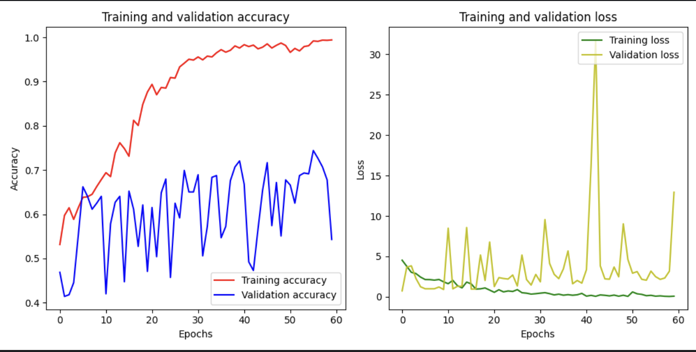
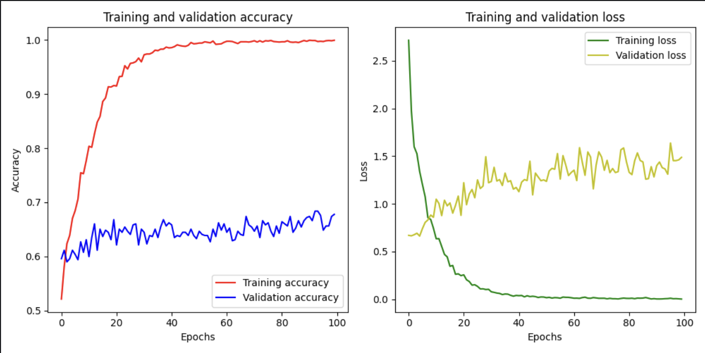
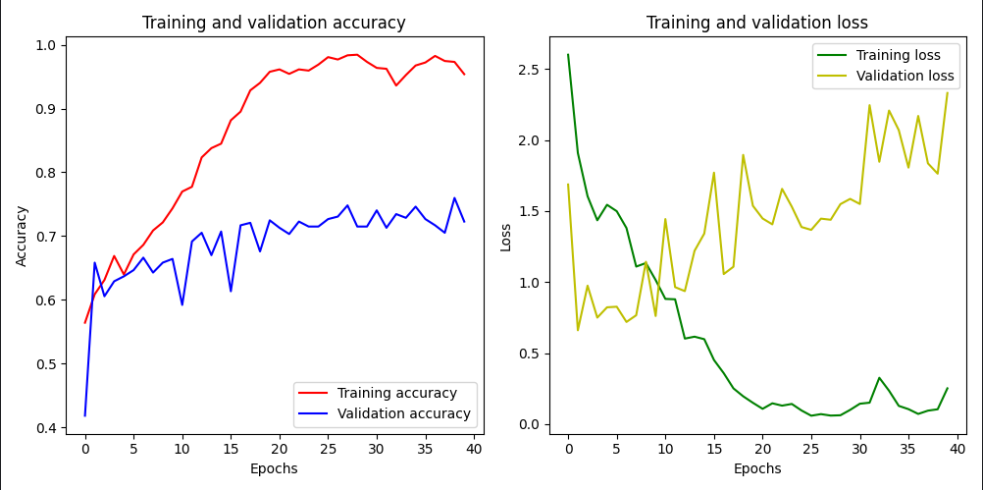
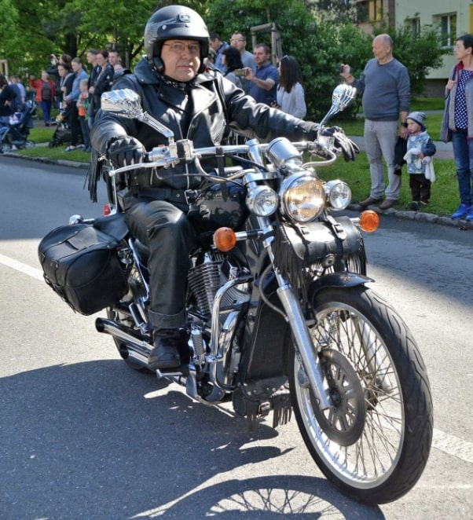
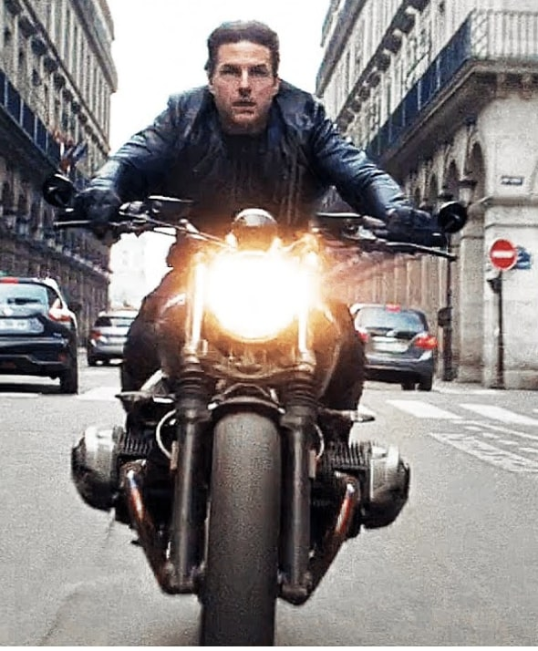
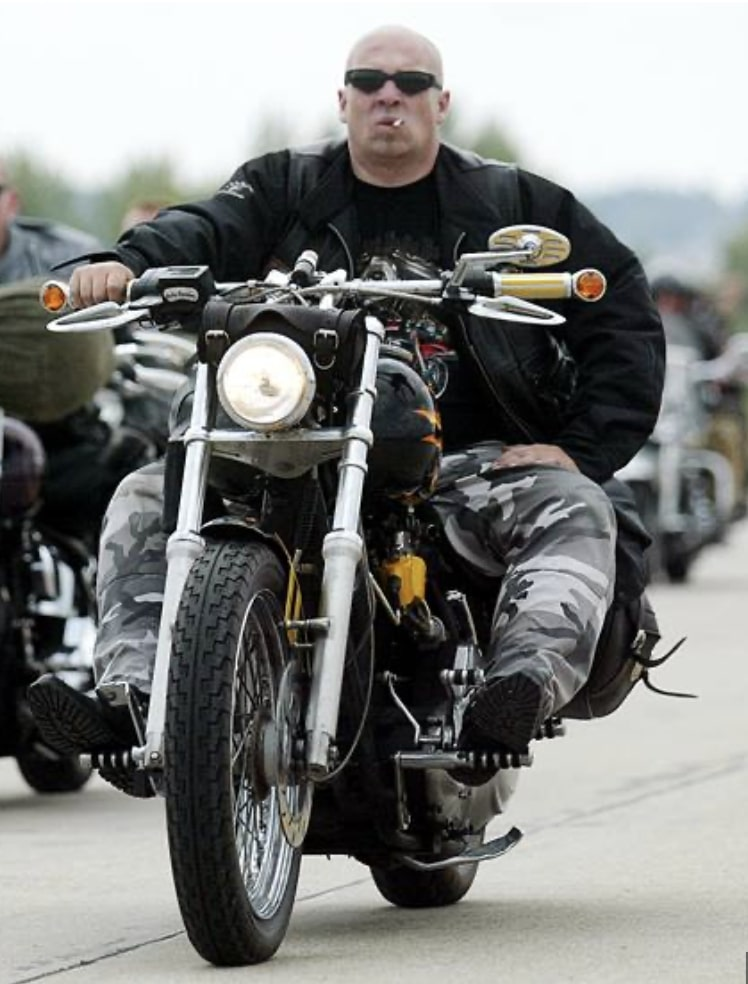

# Requirements

- Pillow
- SciPy
- Tensorflow

# Main dataset

- Kaggle https://www.kaggle.com/datasets/meliodassourav/traffic-violation-dataset-v3?resource=download
- Many problem:
    - duplicate images
    - incorrect labels
    - drawing or computer animation instead of pictures
    - watermarks
    - not uniform size/quality
    - blured
    - small

# Data augmentation

- using ImageDataGenerator from keras_preprocessing.image
    - increase number of training images by:
        - rotation by up to 35 degrees (real photo conditions)
        - zoom in up to 10%
        - mirror effect (horizontal flip)
        - add missing pixel when rotation or moving by reflecting existing in the original picture
        - move horizontally up to 20%
        - shear transformation up to 20% https://en.wikipedia.org/wiki/Shear_mapping

# Optimizer Adam

- binary_crossentropy as loss since we have only 2 categories (helmet yes/no)
- learning_rate is surprisingly low and higher values case suboptimal solution
    - lowering learning rate didn't bring any increase in accuracy only longer congregation

## Learning Rate

### 0.0001



### 0.00001 (10x times lower)



# Convolution layer

- tf.keras.layers.Conv2D(64, kernel_size=11, strides=8, activation='relu', input_shape=(64, 64, 3))
    - 64 filters
    - filter is 11x11 pixel big
    - each filter center is 8 pixels away (it reduces computational time)
    - input image are 64x64 pixels with rgb (3) colors

# Pooling layer

- to reduce number of parameter in the model -> faster training
- tf.keras.layers.MaxPooling2D(2, strides=2)
    - 2 size of the pooling window
        - this will return from 4 pixels (2x2) only one with the max value
        - not suitable for our problem
            - helmet is concentrated in small are on the picture

# Dropout

- In each step we ignore some units
- Strategy to avoid over-fitting
- Slow down learning -> make it more incrementally careful
- tf.keras.layers.Dropout(0.5)
    - we are ignoring every other unit
    - too much dropout cause that model will never reach the best accuracy
        - second dropout seems to have only negative effect (the same or worse result, bigger validation loss)
          

# Batch normalisation

- Rescale output to have sample mean and standard deviation of 1
- Make learning faster
- tf.keras.layers.BatchNormalization()

# Image preprocessing pipeline:

1. Manual picture filtering and adjustment
    - Filter only images that belong to the category
    - Crop only person on the motorcycle with minimum background
    - Add additional images from the internet
2. Convert to the same ratio and size
    - Convert all images to 128 by 128 pixels
    - Keep original ratio and fill missing pixels with white pixels
3. Data augmentation
    - From every image create 4 by:
        - horizontal flip
        - rotation up to x degrees
        - shear transformation
        - move to any side
        - zoom

# Training:

## Input size:

### 96 x 96

- lower than this resolution makes it impossible to distinguish
- fast training
- the highest (73%) accuracy achieved

### 128 x 128

- slightly slower training
- need to decrease learning rate
    - the biggest reasonable ~ 0.0001

### 256 x 256

- exponentially slower training
- surprisingly worse results
- extremely low learning rate

## Validation Split

20% seems to be a reasonable value but slightly lower or higher number didn't change the result anyway.

- 2192 (80%) images for training
- 547 (20%) images for validation

## Epochs

Model seems to learn quickly mainly because of relatively low number of images. There is always some grow up to 10th
epoch then it starts to stagnate up to 20th and after that there wasn't any improvement measured.

## Batch size

Has enormous impact on training duration but no measurable effect on results therefore it good to keep as high as
possible base on CPU and GPU -> the more cores it has to higher batch we can effectively use.

## Shuffle

Helps to avoid fin-tuning the model for one selected validation split.

# Final results:


validation accuracy: 75.78%
validation loss: 1.0044

## Model:

```
_________________________________________________________________
 Layer (type)                Output Shape              Param #   
=================================================================
 conv2d (Conv2D)             (None, 86, 86, 96)        34944     
                                                                 
 batch_normalization (Batch  (None, 86, 86, 96)        384       
 Normalization)                                                  
                                                                 
 max_pooling2d (MaxPooling2  (None, 43, 43, 96)        0         
 D)                                                              
                                                                 
 conv2d_1 (Conv2D)           (None, 43, 43, 128)       995456    
                                                                 
 batch_normalization_1 (Bat  (None, 43, 43, 128)       512       
 chNormalization)                                                
                                                                 
 max_pooling2d_1 (MaxPoolin  (None, 21, 21, 128)       0         
 g2D)                                                            
                                                                 
 conv2d_2 (Conv2D)           (None, 21, 21, 256)       1605888   
                                                                 
 batch_normalization_2 (Bat  (None, 21, 21, 256)       1024      
 chNormalization)                                                
                                                                 
 max_pooling2d_2 (MaxPoolin  (None, 10, 10, 256)       0         
 g2D)                                                            
                                                                 
 conv2d_3 (Conv2D)           (None, 10, 10, 256)       1638656   
                                                                 
 batch_normalization_3 (Bat  (None, 10, 10, 256)       1024      
 chNormalization)                                                
                                                                 
 conv2d_4 (Conv2D)           (None, 10, 10, 512)       1180160   
                                                                 
 batch_normalization_4 (Bat  (None, 10, 10, 512)       2048      
 chNormalization)                                                
                                                                 
 max_pooling2d_3 (MaxPoolin  (None, 5, 5, 512)         0         
 g2D)                                                            
                                                                 
 flatten (Flatten)           (None, 12800)             0         
                                                                 
 dense (Dense)               (None, 2048)              26216448  
                                                                 
 dropout (Dropout)           (None, 2048)              0         
                                                                 
 dense_1 (Dense)             (None, 1000)              2049000   
                                                                 
 dense_2 (Dense)             (None, 1)                 1001      
                                                                 
=================================================================

```

## Memory parameters:

```
Total params: 33726545 (128.66 MB)
Trainable params: 33724049 (128.65 MB)
Non-trainable params: 2496 (9.75 KB)
```

## Training:

```
34/34 [==============================] - ETA: 0s - loss: 2.4986 - accuracy: 0.55502023-06-27 21:07:41.080026: I tensorflow/core/grappler/optimizers/custom_graph_optimizer_registry.cc:114] Plugin optimizer for device_type GPU is enabled.
34/34 [==============================] - 22s 635ms/step - loss: 2.4986 - accuracy: 0.5550 - val_loss: 2.4416 - val_accuracy: 0.4180
Epoch 2/30
34/34 [==============================] - 21s 631ms/step - loss: 2.0065 - accuracy: 0.5987 - val_loss: 1.3601 - val_accuracy: 0.5820
Epoch 3/30
34/34 [==============================] - 21s 630ms/step - loss: 1.5902 - accuracy: 0.6137 - val_loss: 1.2227 - val_accuracy: 0.5957
Epoch 4/30
34/34 [==============================] - 21s 630ms/step - loss: 1.3206 - accuracy: 0.6438 - val_loss: 0.9531 - val_accuracy: 0.6289
Epoch 5/30
34/34 [==============================] - 21s 629ms/step - loss: 1.3766 - accuracy: 0.6466 - val_loss: 0.8313 - val_accuracy: 0.6328
Epoch 6/30
34/34 [==============================] - 21s 630ms/step - loss: 1.1848 - accuracy: 0.6584 - val_loss: 0.7944 - val_accuracy: 0.6387
Epoch 7/30
34/34 [==============================] - 21s 628ms/step - loss: 1.1242 - accuracy: 0.6814 - val_loss: 0.8278 - val_accuracy: 0.6367
Epoch 8/30
34/34 [==============================] - 21s 629ms/step - loss: 1.1504 - accuracy: 0.6682 - val_loss: 0.7009 - val_accuracy: 0.6719
Epoch 9/30
34/34 [==============================] - 21s 631ms/step - loss: 1.0479 - accuracy: 0.6790 - val_loss: 0.9572 - val_accuracy: 0.6543
Epoch 10/30
34/34 [==============================] - 21s 630ms/step - loss: 1.0150 - accuracy: 0.7035 - val_loss: 0.8437 - val_accuracy: 0.6738
Epoch 11/30
34/34 [==============================] - 21s 631ms/step - loss: 0.9548 - accuracy: 0.7007 - val_loss: 0.7220 - val_accuracy: 0.6777
Epoch 12/30
34/34 [==============================] - 22s 635ms/step - loss: 0.9246 - accuracy: 0.7157 - val_loss: 0.7352 - val_accuracy: 0.6797
Epoch 13/30
34/34 [==============================] - 21s 627ms/step - loss: 0.8602 - accuracy: 0.7195 - val_loss: 0.7478 - val_accuracy: 0.6699
Epoch 14/30
34/34 [==============================] - 21s 625ms/step - loss: 0.8148 - accuracy: 0.7453 - val_loss: 0.7660 - val_accuracy: 0.6895
Epoch 15/30
34/34 [==============================] - 21s 625ms/step - loss: 0.9840 - accuracy: 0.7195 - val_loss: 0.7171 - val_accuracy: 0.7090
Epoch 16/30
34/34 [==============================] - 21s 623ms/step - loss: 0.8743 - accuracy: 0.7354 - val_loss: 0.7665 - val_accuracy: 0.6953
Epoch 17/30
34/34 [==============================] - 21s 622ms/step - loss: 0.6715 - accuracy: 0.7838 - val_loss: 0.7393 - val_accuracy: 0.7012
Epoch 18/30
34/34 [==============================] - 21s 624ms/step - loss: 0.6591 - accuracy: 0.7890 - val_loss: 0.7091 - val_accuracy: 0.7129
Epoch 19/30
34/34 [==============================] - 21s 628ms/step - loss: 0.5345 - accuracy: 0.8134 - val_loss: 0.6943 - val_accuracy: 0.7422
Epoch 20/30
34/34 [==============================] - 21s 622ms/step - loss: 0.4640 - accuracy: 0.8304 - val_loss: 1.0385 - val_accuracy: 0.6895
Epoch 21/30
34/34 [==============================] - 22s 636ms/step - loss: 0.4405 - accuracy: 0.8470 - val_loss: 0.8319 - val_accuracy: 0.6875
Epoch 22/30
34/34 [==============================] - 21s 624ms/step - loss: 0.4005 - accuracy: 0.8731 - val_loss: 0.6759 - val_accuracy: 0.7578
Epoch 23/30
34/34 [==============================] - 21s 624ms/step - loss: 0.2998 - accuracy: 0.8919 - val_loss: 0.7398 - val_accuracy: 0.7422
Epoch 24/30
34/34 [==============================] - 21s 624ms/step - loss: 0.3265 - accuracy: 0.8999 - val_loss: 0.8939 - val_accuracy: 0.7207
Epoch 25/30
34/34 [==============================] - 21s 624ms/step - loss: 0.3150 - accuracy: 0.8971 - val_loss: 0.8511 - val_accuracy: 0.7480
Epoch 26/30
34/34 [==============================] - 21s 624ms/step - loss: 0.2053 - accuracy: 0.9262 - val_loss: 0.8156 - val_accuracy: 0.7520
Epoch 27/30
34/34 [==============================] - 21s 624ms/step - loss: 0.1392 - accuracy: 0.9478 - val_loss: 0.8929 - val_accuracy: 0.7520
Epoch 28/30
34/34 [==============================] - 21s 623ms/step - loss: 0.1134 - accuracy: 0.9582 - val_loss: 1.2607 - val_accuracy: 0.7070
Epoch 29/30
34/34 [==============================] - 21s 622ms/step - loss: 0.1769 - accuracy: 0.9427 - val_loss: 1.2037 - val_accuracy: 0.7363
Epoch 30/30
34/34 [==============================] - 21s 627ms/step - loss: 0.1557 - accuracy: 0.9478 - val_loss: 1.0044 - val_accuracy: 0.7578
```

## False Negative:



## False Positive:





