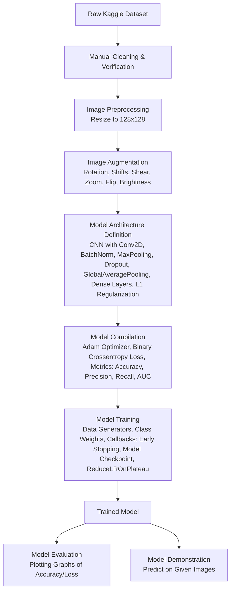
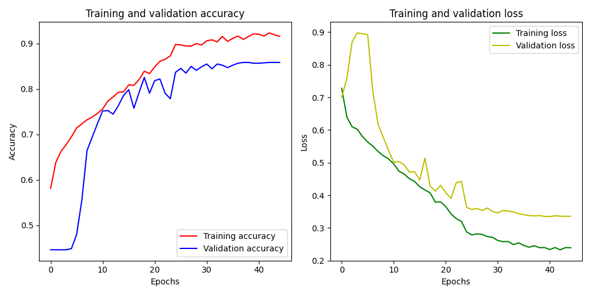

# Helmet Detection Model

This project is a playground to explore and understand the concepts behind training a Convolutional Neural Network (CNN)
for helmet detection. It demonstrates how fine-tuning various parameters and applying image augmentation can impact
overall model performance.

## Getting Started

To try out this code, follow these steps:

### Prerequisites

First, ensure you have all the necessary Python packages installed. You can do this by running:

```shell
pip install -r requirements.txt
```

### Running the Demo with a Pre-trained Model

A pre-trained model, `trained_model_provided.h5`, is available. To use this model for a demonstration:

1. Open `config.py`.
2. Update the `TRAINED_MODEL` variable to point to `trained_model_provided.h5`.
3. Run the `main.py` script without any arguments to test it with the default images, or provide a path to your own
   image for testing (see below).

### Training Your Own Model

If you wish to train the model from scratch and generate your own resized and augmented images:

1. Make sure your raw images are placed in the `source/helme`t and `source/no_helmet` directories.
2. Delete the existing resized and training directories if they exist. This will force the script to regenerate the
   augmented dataset.
3. Run the `main.py` script. The script will automatically perform image resizing, augmentation, model training, and
   save the trained model.

### Testing the Demo with Your Own Picture

To test the trained model (either your own or the provided `trained_model_provided.h5`) with a custom image:

1. Ensure `TRAINED_MODEL` in config.py is set to the model you want to use (`trained_model.h5` if you trained your own,
   or `trained_model_provided.h5` for the pre-trained one).
2. Run the `main.py` script, providing the path to your picture as the first command-line argument:

```shell
python main.py /path/to/your/picture.jpg
```

**Note**: For convenience, there are also some demo images located in the `demo_images` folder, with names following the
format `helmet_0.png` through `helmet_4.png` or `no_helmet_0.png` through `no_helmet_4.png`. 

## How it Works



The system automates the process of image augmentation, model training, and evaluation for helmet detection. Here's a
breakdown of the workflow:

### 1. Image Preprocessing and Augmentation

Before training, the raw images are preprocessed and augmented to create a larger and more diverse dataset. This is
crucial for improving the model's generalization capabilities and preventing overfitting.

* **Resizing**: All input images are resized to a uniform dimension of 128x128 pixels. This standardization is important
  for consistent input to the neural network. The `resize_images` function in `utils.py` handles this, ensuring that the
  aspect ratio is maintained by padding the images with a white background if necessary.
* **Augmentation**: The `augment_pictures` function in `main.py` uses Keras' `ImageDataGenerator` to create augmented
  versions of the images. For each original image, 10 augmented copies are generated. These augmentations
  include:
    * **Rotation**: Random rotations up to 35 degrees.
    * **Width and Height Shifts**: Shifting the image horizontally up to 20% of its width.
    * **Shear**: Shearing transformations up to 20%.
    * **Zoom**: Zooming in or out by up to 10%.
    * **Horizontal Flip**: Randomly flipping images horizontally.
    * **Brightness Range**: Adjusting the brightness between 70% and 130% of the original.
    * **Fill Mode**: Using 'reflect' to fill in new pixels created by transformations.

  This augmentation process significantly expands the training dataset, making the model more robust to variations in
  real-world images. The augmented images are saved to the `training` directory, separated into `helmet` and `no_helmet`
  subdirectories.

### 2. Model Architecture

The core of this project is a Convolutional Neural Network (CNN) built using Keras' Sequential API. The `get_model`
function defines the architecture, which consists of several convolutional blocks followed by dense layers:

* **Convolutional Layers (`Conv2D`)**: These layers extract features from the input images using 3x3 filters (kernel).
  The number of filters increases in deeper layers (32, 64, 128, 256), allowing the model to learn increasingly complex
  patterns.`ReLU` (Rectified Linear Unit) is used as the activation function, introducing non-linearity.
* **Batch Normalization (`BatchNormalization`)**: Applied after each convolutional layer, Batch Normalization helps
  stabilize and speed up the training process by normalizing the activations of the previous layer.
* **Max Pooling Layers (`MaxPooling2D`)**: These layers reduce the spatial dimensions of the feature maps, helping to
  reduce computational complexity and control overfitting. A 2x2 pool size is used.
* **Dropout Layers (`Dropout`)**: Dropout is a regularization technique where a fraction of the neurons are randomly set
  to zero during training. This prevents overfitting by making the network less reliant on specific neurons. Dropout
  rates of 0.4 and 0.5 are used in the later stages of the network.
* **Global Average Pooling (`GlobalAveragePooling2D`)**: Instead of flattening the feature maps, this layer calculates
  the average of each feature map, significantly reducing the number of parameters and making the model more robust to
  spatial translations. (e.g. this will return from 4 pixels (2x2) only one with the average value)
* **Dense Layers (`Dense`)**: These are fully connected layers. The first dense layer has 128 neurons with a 'relu'
  activation.
* **Output Layer**: The final dense layer has a single neuron with a 'sigmoid' activation function. This is because it's
  a binary classification problem (helmet or no helmet), and the sigmoid function outputs a probability between 0 and 1.
  A threshold of 0.5 is used to classify the output.
* **L1 Regularization**: L1 regularization is applied to the kernel weights of the convolutional and dense layers. This
  helps to prevent overfitting by adding a penalty proportional to the absolute value of the weights, encouraging
  sparsity in the model.

### 3. Model Compilation and Training

The model is compiled and trained using the `compile_model` and `fit_model` functions in `main.py`.

* **Optimizer**: The Adam optimizer is used, with a learning rate of 0.00005. The `get_adam` function provides
  compatibility for different system architectures, including ARM processors on macOS.
* **Loss Function**: `binary_crossentropy` is used as the loss function, which is standard for binary classification
  problems.
* **Metrics**: The model is evaluated based on `accuracy`, `Precision`, `Recall`, and `AUC` (Area Under the Receiver
  Operating Characteristic Curve).
* **Data Generators**: `ImageDataGenerator` is used to efficiently feed batches of augmented image data to the model
  during training and validation.
* **Class Weights**: Class weights are computed and applied to handle potential class imbalance in the dataset. This
  ensures that the model doesn't bias towards the majority class.
* **Callbacks**: Several callbacks are used during training to optimize the process:
    * **Early Stopping**: Monitors validation accuracy and stops training if it doesn't improve for seven consecutive
      epochs, restoring the best weights. This prevents overfitting and saves training time.
    * **Model Checkpoint**: Saves the model with the best validation accuracy to `trained_model.h5`.
    * **ReduceLROnPlateau**: Reduces the learning rate by a factor of 0.2 if validation accuracy doesn't improve for 5
      epochs, with a minimum learning rate of 1e-7. This helps the model converge more effectively.
* **Epochs**: The model is trained for a maximum of 100 epochs.
* **Validation Split**: 20% of the augmented data is used for validation during training.

#### Customizable Parameters

All key parameters for model configuration, augmentation, and training can be easily modified in the `config.py` file,
allowing for flexible experimentation and fine-tuning.

### 4. Model Evaluation and Demonstration

After training, the model's performance is visualized as you can see bellow, and a demonstration function is provided:



* **Plotting Graphs**: The `plot_graph` function visualizes the training and validation accuracy and loss over epochs,
  providing insights into the model's learning process and identifying potential overfitting or underfitting.
* **Demonstration**: The `demo` function loads the trained model and allows users to test it with a new image. It
  preprocesses the input image, makes a prediction, and displays whether a helmet is likely present or not.

## Dataset

The dataset used for this project is
the [Traffic Violation Dataset v3](https://www.kaggle.com/datasets/meliodassourav/traffic-violation-dataset-v3?resource=download)
from Kaggle. This dataset was chosen for its relevance to the problem of helmet detection. However, it's important to
acknowledge that the raw dataset presented several challenges, which are common in real-world image datasets:

* **Duplicate Images**: The dataset contained duplicate images, which can lead to biased training and an overestimation
  of model performance.
* **Incorrect Labels**: Some images were mislabeled, meaning a "helmet" image might have been labeled as "no helmet" or
  vice-versa. Incorrect labels introduce noise into the training process.
* **Drawing or Computer Animation Instead of Pictures**: The dataset included images that were not actual photographs
  but rather drawings or computer animations, which are not representative of real-world scenarios the model is intended
  for.
* **Watermarks**: The presence of watermarks on images can interfere with feature extraction by the model.
* **Not Uniform Size/Quality**: Images varied significantly in size and quality, requiring the preprocessing steps to
  standardize them.
* **Blurred Images**: Some images were blurred, making it difficult for the model to extract clear features.
* **Small Images**: Very small images offer limited information for the model to learn from.

These issues highlight the critical importance of data quality in machine learning. While image augmentation helps, the
dataset used in this project has been manually cleaned to address problems like duplicates, incorrect labels, and
irrelevant content (e.g., drawings, watermarks, blurred/small images). This current project therefore operates on a
pre-cleaned dataset. It's worth noting that even further improvements to the dataset's quality would likely lead to even
greater model accuracy.

## Playground Project Disclaimer

It is important to explicitly state that **this is solely a playground project designed to understand fundamental
concepts and experiment with how fine-tuning can improve overall model performance.** This model is not intended for
production use without further rigorous testing, validation, and potential improvements for real-world scenarios.

## Tips for Training

### Install on Mac with Apple Silicon

To maximize training efficiency and performance, it's crucial to fully utilize available hardware accelerators. For
users with Apple Silicon, TensorFlow with Metal Performance Shaders (MPS) provides significant speedups by leveraging
the integrated GPU.

This project's `main.py` is configured to recognize and utilize Apple Silicon's arm64 architecture, ensuring that
TensorFlow can use the optimized backend for faster computations. Typically, you would install the `tensorflow-metal`
package and ensure your TensorFlow and Keras versions are compatible (as seen in `requirements.txt`). If you're on a
compatible system, this setup should automatically benefit from GPU acceleration during training. To verify if your GPU
is being used, you can often look for logs indicating GPU device initialization when TensorFlow starts, or check your
system's activity monitor during training. For a more direct confirmation, a simple script named `gpu_verificator.py`
has been included in the project for this purpose.
